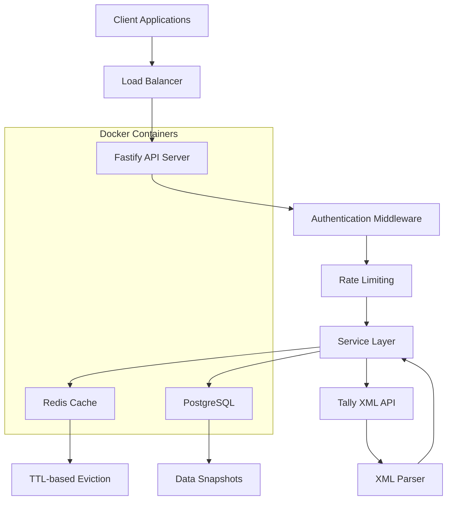
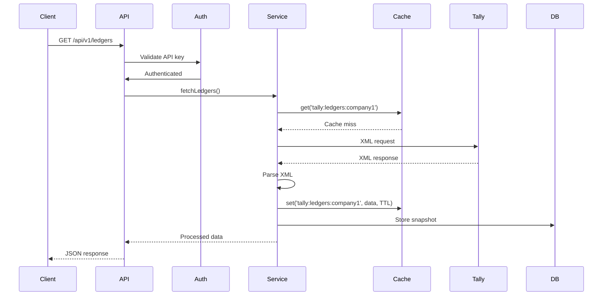
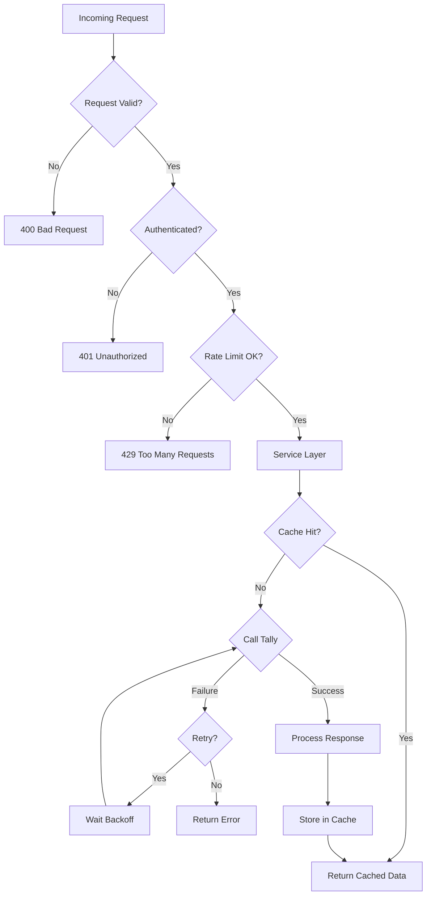

# Architecture Documentation

Deep dive into the system design, components, and data flow of the Tally Integration API.

## 🏗️ High-Level System Architecture



## 🧩 Core Components

### 1. API Gateway (Fastify Server)

**Purpose**: Entry point for all client requests

**Responsibilities**:
- HTTP request handling
- Request validation
- Response formatting
- Error handling
- Logging and monitoring

**Key Features**:
- High-performance async I/O
- Built-in schema validation
- Plugin architecture
- Graceful shutdown

### 2. Authentication & Security Layer

**Purpose**: Secure API access

**Components**:
- **API Key Authentication**: Simple server-to-server auth
- **Rate Limiting**: Prevent abuse and overload
- **CORS**: Cross-origin resource sharing
- **Security Headers**: Helmet.js integration

**Implementation**:
```javascript
// API Key validation
apiKey = req.query.apiKey || req.headers['x-api-key']
allowedKeys = process.env.API_KEYS.split(',')

// Rate limiting
await fastify.register(require('@fastify/rate-limit'), {
  max: 100,
  timeWindow: '1 minute'
})
```

### 3. Service Layer

**Purpose**: Business logic and orchestration

**Components**:
- **Ledger Service**: Fetches and processes ledger data
- **Voucher Service**: Handles voucher transactions
- **Report Service**: Generates financial reports
- **Cache Manager**: Intelligent caching strategy

**Design Patterns**:
- **Repository Pattern**: Data access abstraction
- **Circuit Breaker Pattern**: Fault tolerance
- **Cache-Aside Pattern**: Performance optimization

### 4. Tally Connector

**Purpose**: Communication with Tally XML API

**Components**:
- **HTTP Client**: Axios-based with timeout and retries
- **XML Builder**: Creates Tally-compatible XML requests
- **Response Parser**: Converts XML to structured JSON
- **Connection Pool**: Efficient connection management

**Circuit Breaker Implementation**:
```javascript
class CircuitBreaker {
  constructor(threshold = 5, timeout = 60000) {
    this.failureThreshold = threshold
    this.timeout = timeout
    this.failureCount = 0
    this.state = 'CLOSED' // CLOSED, OPEN, HALF_OPEN
  }
  
  async execute(operation) {
    if (this.state === 'OPEN') {
      if (Date.now() - this.lastFailure > this.timeout) {
        this.state = 'HALF_OPEN'
      } else {
        throw new Error('Circuit breaker is OPEN')
      }
    }
    
    try {
      const result = await operation()
      this.onSuccess()
      return result
    } catch (error) {
      this.onFailure()
      throw error
    }
  }
}
```

### 5. Cache Layer (Redis)

**Purpose**: Performance optimization and Tally load reduction

**Strategy**:
- **Cache-Aside Pattern**: Application manages cache
- **TTL-based Eviction**: Automatic expiration
- **Write-through**: Optional for critical data
- **Cache Invalidation**: Smart invalidation on data changes

**Cache Keys Structure**:
```
tally:ledgers:{company_id}:{hash}
tally:vouchers:{company_id}:{date_range}
tally:reports:{company_id}:{report_type}:{date_range}
```

### 6. Data Processing Layer

**Purpose**: Transform and enrich Tally data

**Components**:
- **XML Parser**: Handles Tally's XML quirks
- **Data Normalizer**: Standardizes data formats
- **Data Enricher**: Adds computed fields
- **Validator**: Ensures data quality

**XML Processing Challenges**:
```javascript
// Handle Tally's XML quirks
function parseAmount(value) {
  // Tally uses parentheses for negative amounts
  if (value.startsWith('(') && value.endsWith(')')) {
    return -parseFloat(value.slice(1, -1))
  }
  return parseFloat(value) || 0
}

// Handle date formats
function parseTallyDate(tallyDate) {
  // Convert "1-Apr-2023" to "2023-04-01"
  const months = ['Jan','Feb','Mar','Apr','May','Jun','Jul','Aug','Sep','Oct','Nov','Dec']
  const [day, month, year] = tallyDate.split('-')
  const monthIndex = months.indexOf(month) + 1
  return `${year}-${monthIndex.toString().padStart(2, '0')}-${day.padStart(2, '0')}`
}
```

## 📊 Data Flow Architecture

### Request Flow



### Cache Flow Patterns

**Cache Hit (Fast Path)**:
1. Client request → API
2. Service checks cache
3. Cache returns data
4. Response sent immediately

**Cache Miss (Slow Path)**:
1. Client request → API
2. Service checks cache → miss
3. Service calls Tally
4. Parse and process response
5. Store in cache
6. Return response

### Error Handling Flow



## 🗄️ Database Architecture

### PostgreSQL Schema

```sql
-- Companies table
CREATE TABLE companies (
    id SERIAL PRIMARY KEY,
    name VARCHAR(255) NOT NULL,
    guid VARCHAR(50) UNIQUE,
    created_at TIMESTAMP DEFAULT NOW(),
    updated_at TIMESTAMP DEFAULT NOW()
);

-- Ledgers table
CREATE TABLE ledgers (
    id SERIAL PRIMARY KEY,
    company_id INTEGER REFERENCES companies(id),
    name VARCHAR(255) NOT NULL,
    parent VARCHAR(255),
    opening_balance DECIMAL(15,2),
    closing_balance DECIMAL(15,2),
    guid VARCHAR(50),
    created_at TIMESTAMP DEFAULT NOW(),
    updated_at TIMESTAMP DEFAULT NOW()
);

-- Snapshots for historical data
CREATE TABLE ledger_snapshots (
    id SERIAL PRIMARY KEY,
    company_id INTEGER REFERENCES companies(id),
    snapshot_date DATE NOT NULL,
    ledger_data JSONB NOT NULL,
    created_at TIMESTAMP DEFAULT NOW()
);

-- API usage tracking
CREATE TABLE api_usage (
    id SERIAL PRIMARY KEY,
    endpoint VARCHAR(255) NOT NULL,
    api_key_hash VARCHAR(255) NOT NULL,
    response_time INTEGER,
    status_code INTEGER,
    created_at TIMESTAMP DEFAULT NOW()
);
```

### Indexing Strategy

```sql
-- Performance indexes
CREATE INDEX idx_ledgers_company_id ON ledgers(company_id);
CREATE INDEX idx_ledgers_name ON ledgers(name);
CREATE INDEX idx_snapshots_date ON ledger_snapshots(snapshot_date);
CREATE INDEX idx_api_usage_created_at ON api_usage(created_at);

-- JSONB indexes for complex queries
CREATE INDEX idx_ledger_snapshots_data ON ledger_snapshots USING GIN(ledger_data);
```

## 🔧 Configuration Architecture

### Environment-Based Configuration

```javascript
// config/index.js
module.exports = {
  development: {
    redis: { url: 'redis://localhost:6379' },
    database: { url: 'postgresql://localhost/tally_dev' },
    logging: { level: 'debug' }
  },
  
  production: {
    redis: { url: process.env.REDIS_URL },
    database: { url: process.env.DATABASE_URL },
    logging: { level: 'info' }
  },
  
  test: {
    redis: { url: 'redis://localhost:6379/1' },
    database: { url: 'postgresql://localhost/tally_test' },
    logging: { level: 'silent' }
  }
}
```

### Feature Flags

```javascript
// Enable/disable features without deployment
const features = {
  enableCache: process.env.ENABLE_CACHE !== 'false',
  enableSnapshots: process.env.ENABLE_SNAPSHOTS === 'true',
  enableMetrics: process.env.ENABLE_METRICS === 'true',
  enableRateLimit: process.env.ENABLE_RATE_LIMIT !== 'false'
}
```

## 🔌 Integration Patterns

### External Service Integration

**Tally Integration**:
- **Protocol**: HTTP over XML
- **Authentication**: None (local network)
- **Error Handling**: Circuit breaker + retries
- **Timeout**: 10 seconds default
- **Retry Strategy**: Exponential backoff

**Redis Integration**:
- **Protocol**: Redis protocol
- **Connection Pool**: 5 connections
- **Failover**: Built-in Redis clustering
- **Persistence**: RDB + AOF

**PostgreSQL Integration**:
- **Protocol**: PostgreSQL wire protocol
- **Connection Pool**: PgBouncer recommended
- **Transactions**: ACID compliance
- **Migrations**: Automated via node-pg-migrate

## 🚀 Scalability Architecture

### Horizontal Scaling

**Stateless Design**:
- API servers are stateless
- Session data stored in Redis
- Database connections pooled
- Load balancer friendly

**Scaling Strategies**:
```yaml
# docker-compose.scale.yml
services:
  app:
    image: tally-app:latest
    scale: 3  # Run 3 instances
    environment:
      - NODE_ENV=production
    depends_on:
      - redis
      - postgres
```

### Performance Optimization

**Caching Strategy**:
- **L1 Cache**: In-memory (per request)
- **L2 Cache**: Redis (distributed)
- **L3 Cache**: Database snapshots

**Database Optimization**:
- **Read Replicas**: For reporting queries
- **Connection Pooling**: Reduce overhead
- **Batch Operations**: Bulk inserts/updates
- **Partitioning**: By company/date

## 🔍 Monitoring & Observability

### Logging Architecture

```javascript
// Structured logging with Pino
const logger = pino({
  level: process.env.LOG_LEVEL || 'info',
  formatters: {
    log: (object) => {
      return { ...object, service: 'tally-api' }
    }
  },
  transport: process.env.NODE_ENV !== 'production' ? {
    target: 'pino-pretty'
  } : undefined
})
```

### Metrics Collection

**Key Metrics**:
- Request rate and response times
- Error rates by endpoint
- Cache hit/miss ratios
- Database query performance
- Tally API response times

**Health Checks**:
```javascript
// Comprehensive health check
async function healthCheck() {
  const checks = {
    api: { status: 'ok' },
    database: await checkDatabase(),
    redis: await checkRedis(),
    tally: await checkTally()
  }
  
  const healthy = Object.values(checks).every(c => c.status === 'ok')
  
  return {
    status: healthy ? 'healthy' : 'unhealthy',
    checks,
    timestamp: new Date().toISOString()
  }
}
```

## 🔮 Future Architecture Considerations

### Microservices Evolution

**Potential Service Split**:
- **API Gateway**: Routing and authentication
- **Ledger Service**: Ledger-specific operations
- **Voucher Service**: Transaction processing
- **Report Service**: Analytics and reporting
- **Notification Service**: Webhooks and events

### Event-Driven Architecture

**Event Patterns**:
```javascript
// Event-driven data updates
eventBus.emit('ledger.updated', {
  companyId: 'company1',
  ledgerId: 'ledger1',
  changes: { name: 'New Name' }
})

// Event consumers
eventBus.on('ledger.updated', async (event) => {
  await cache.invalidate(`ledgers:${event.companyId}`)
  await webhook.send(event)
})
```

### Cloud-Native Features

**Kubernetes Deployment**:
- **Helm Charts**: For complex deployments
- **Auto-scaling**: Based on CPU/memory metrics
- **Service Mesh**: Istio for traffic management
- **Serverless**: Lambda for burst workloads

---

**🏛️ This architecture ensures scalability, reliability, and maintainability for production Tally integrations.**
